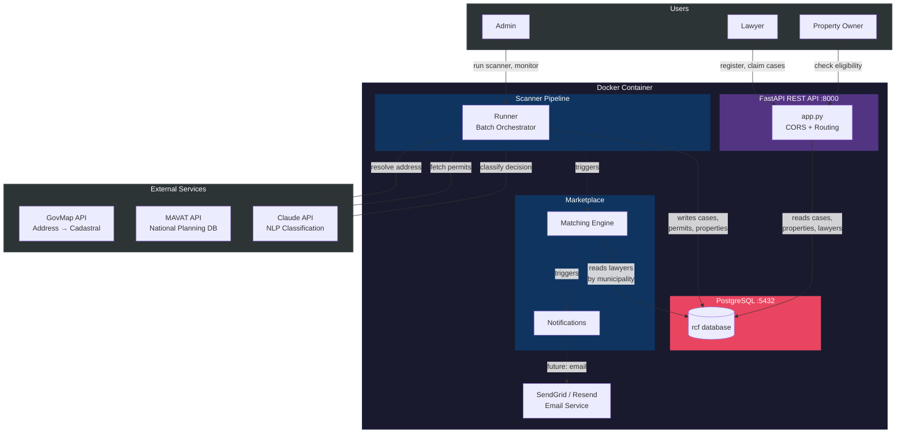
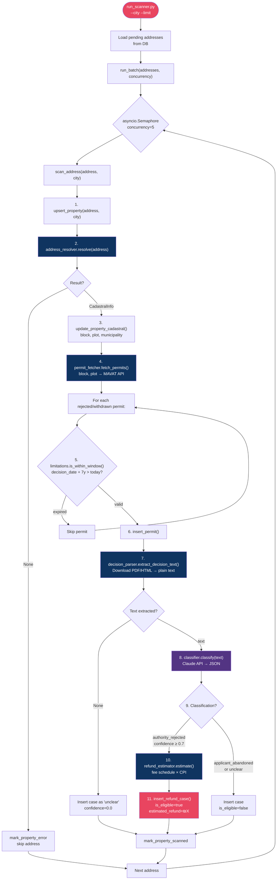
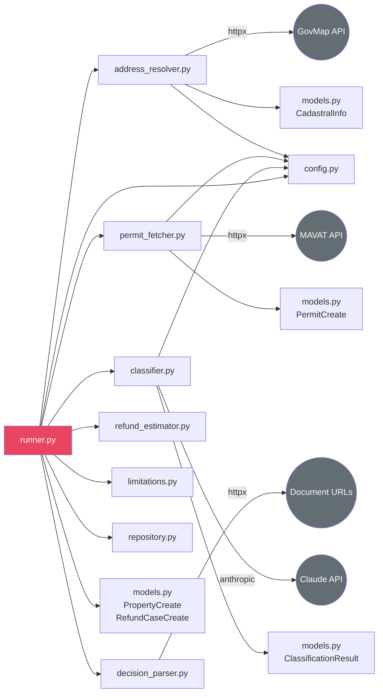
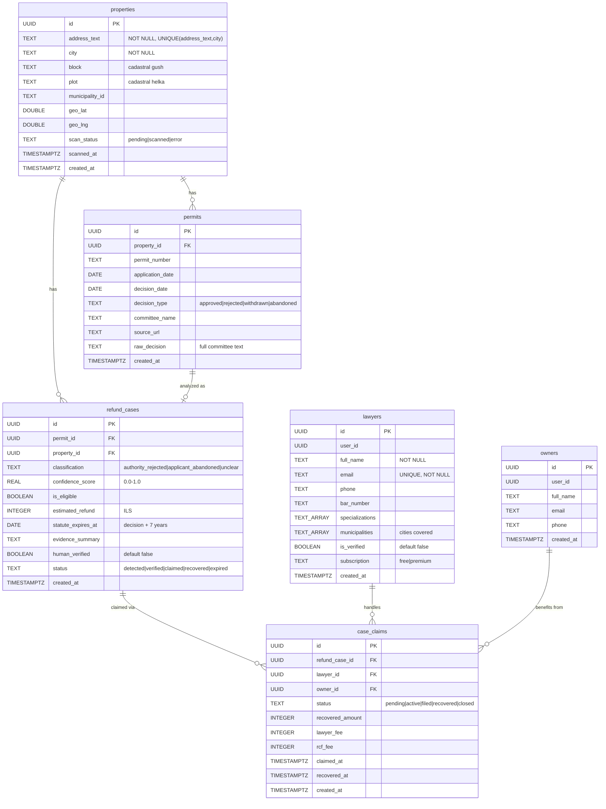
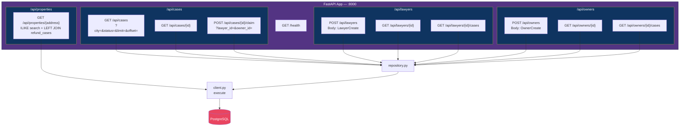
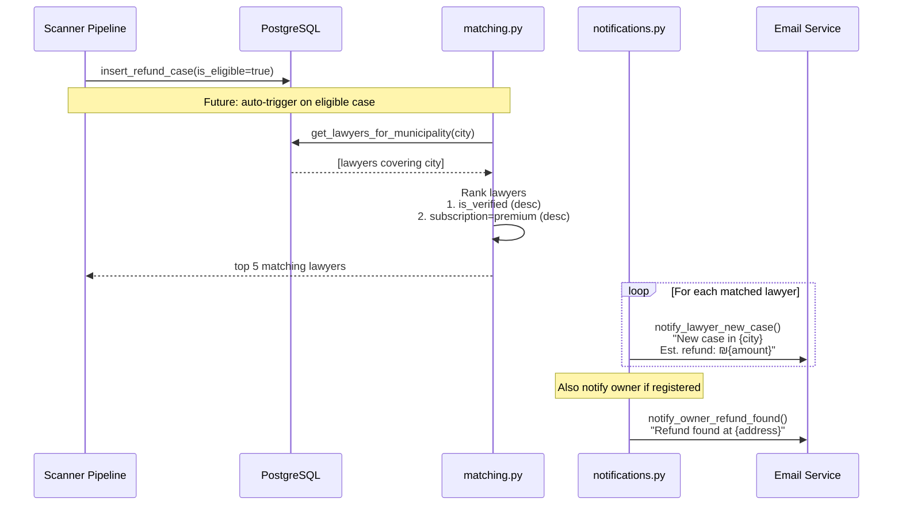
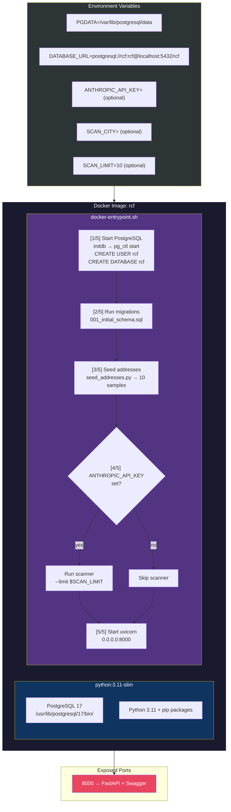

# RCF System Architecture

## 1. High-Level System Overview



---

## 2. Scanner Pipeline — Low-Level Design



### Scanner Module Dependencies



---

## 3. Database Schema — Low-Level Design



### Key Indexes

```
properties(city)                              — filter by city
properties(block, plot)                       — cadastral lookup
properties(scan_status)                       — pending queue
permits(property_id)                          — permits per property
permits(decision_type)                        — filter rejected
refund_cases(is_eligible) WHERE TRUE          — partial index
refund_cases(status)                          — case workflow
refund_cases(property_id)                     — cases per property
lawyers USING GIN(municipalities)             — array containment
case_claims(lawyer_id)                        — lawyer portfolio
case_claims(status)                           — claim workflow
```

---

## 4. API Layer — Low-Level Design



### API Route Details

| Method | Endpoint | Auth | Query Params | Response |
|--------|----------|------|-------------|----------|
| `GET` | `/health` | None | — | `{"status": "ok"}` |
| `GET` | `/api/cases` | — | `city`, `status`, `limit` (≤200), `offset` | `[{case + property}]` |
| `GET` | `/api/cases/{id}` | — | — | `{case + property + permit}` or 404 |
| `POST` | `/api/cases/{id}/claim` | — | `lawyer_id`, `owner_id?` | `{claim}` or 400/404 |
| `GET` | `/api/properties/{address}` | — | — | `[{property + refund_case}]` or 404 |
| `POST` | `/api/lawyers` | — | Body: JSON | `{lawyer}` |
| `GET` | `/api/lawyers/{id}` | — | — | `{lawyer}` or 404 |
| `GET` | `/api/lawyers/{id}/cases` | — | — | `[{claim + case + property}]` |
| `POST` | `/api/owners` | — | Body: JSON | `{owner}` |
| `GET` | `/api/owners/{id}` | — | — | `{owner}` or 404 |
| `GET` | `/api/owners/{id}/cases` | — | — | `[{claim + case + property + lawyer}]` |

---

## 5. Marketplace — Low-Level Design



### Matching Algorithm

```
find_matching_lawyers(city, limit=5):
    1. Query: lawyers WHERE city = ANY(municipalities)
    2. Sort by: (is_verified DESC, subscription='premium' DESC)
    3. Return top `limit` lawyers

match_case_to_lawyers(refund_case):
    1. Extract city from refund_case → properties → city
    2. Delegate to find_matching_lawyers(city)
```

---

## 6. Data Layer — Low-Level Design

```mermaid
graph TD
    subgraph Repository["repository.py — CRUD Operations"]
        direction LR

        subgraph PropOps["Property Ops"]
            UP[upsert_property]
            UPC[update_property_cadastral]
            MPS[mark_property_scanned]
            MPE[mark_property_error]
            GPP[get_pending_properties]
        end

        subgraph PermitOps["Permit Ops"]
            IP[insert_permit]
            UPDT[update_permit_decision_text]
            GPF[get_permits_for_property]
        end

        subgraph CaseOps["Refund Case Ops"]
            IRC[insert_refund_case]
            URCS[update_refund_case_status]
            GEC[get_eligible_cases]
            GRC[get_refund_case]
        end

        subgraph LawyerOps["Lawyer Ops"]
            IL[insert_lawyer]
            GLM[get_lawyers_for_municipality]
            GL[get_lawyer]
        end

        subgraph OwnerOps["Owner Ops"]
            IO[insert_owner]
            GO[get_owner]
        end

        subgraph ClaimOps["Claim Ops"]
            ICC[insert_case_claim]
            GCL[get_claims_for_lawyer]
            GCO[get_claims_for_owner]
        end
    end

    subgraph Client["client.py"]
        CONN["get_conn()<br/>psycopg singleton<br/>autocommit=True"]
        EXEC["execute(sql, params)<br/>→ list[dict]"]
        EXEC1["execute_one(sql, params)<br/>→ dict | None"]
    end

    Repository --> Client
    Client --> PG[(PostgreSQL<br/>dict_row mode)]

    subgraph Models["models.py — Pydantic v2"]
        PC[PropertyCreate]
        PMC[PermitCreate]
        RCC[RefundCaseCreate]
        LC[LawyerCreate]
        OC[OwnerCreate]
        CCC[CaseClaimCreate]
        CI[CadastralInfo]
        CR[ClassificationResult]
    end

    UP -.->|accepts| PC
    IP -.->|accepts| PMC
    IRC -.->|accepts| RCC
    IL -.->|accepts| LC
    IO -.->|accepts| OC
    ICC -.->|accepts| CCC

    style Repository fill:#0f3460,color:#fff
    style Client fill:#533483,color:#fff
    style PG fill:#e94560,color:#fff
    style Models fill:#2d3436,color:#fff
```



---

## 7. Docker Deployment — Low-Level Design



### Run Commands

```bash
# Basic (API only, no scanning)
docker build -t rcf .
docker run -d --name rcf -p 8000:8000 rcf

# With scanner
docker run -d --name rcf -p 8000:8000 \
  -e ANTHROPIC_API_KEY=sk-ant-... \
  -e SCAN_CITY="תל אביב" \
  -e SCAN_LIMIT=50 \
  rcf
```
